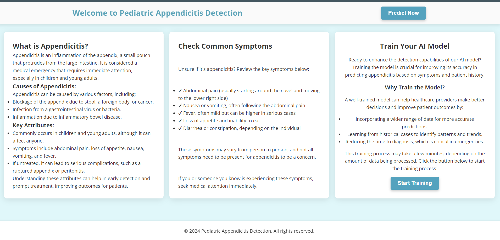
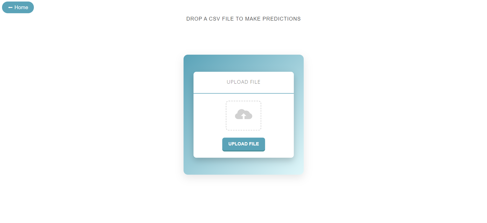

# Regensburg Pediatric Appendicitis Detection

## Table of Contents
- [Project Overview](#project-overview)
- [Features](#features)
- [Technologies Used](#technologies-used)
- [Installation](#installation)
- [Usage](#usage)
- [File Upload](#file-upload)
- [Contributing](#contributing)
- [License](#license)

## Project Overview
The Regensburg Pediatric Appendicitis Detection project aims to provide a user-friendly web application that leverages machine learning to assist healthcare professionals in diagnosing appendicitis in pediatric patients. By allowing users to upload relevant CSV files containing patient data, the application can predict the likelihood of appendicitis.

## Features
- User-friendly file upload interface
- Machine learning model predictions based on uploaded data
- Responsive design for mobile and desktop users
- Cool blue-themed UI for a professional appearance

## Technologies Used
- **Frontend**: HTML, CSS, JavaScript
- **Backend**: Flask (Python)
- **Machine Learning**: Scikit-learn
- **Database**: MongoDB

## Installation
To set up the project locally, follow these steps:

1. Clone the repository:
2. Navigate to the project directory
3. Create virtual env.
4. activate virtual env
5. python app.py

## Images:

